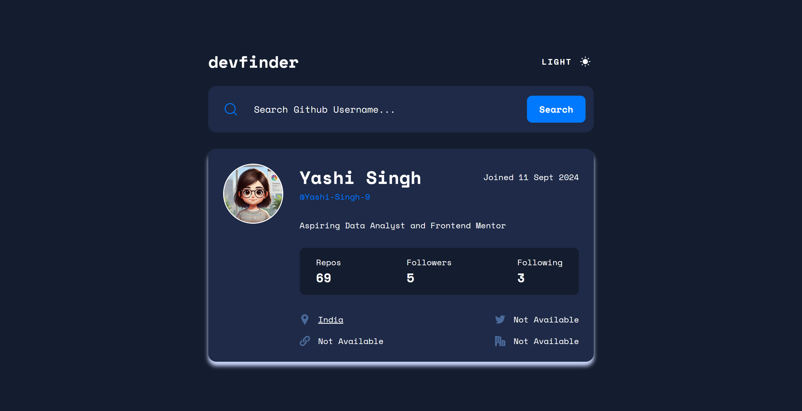
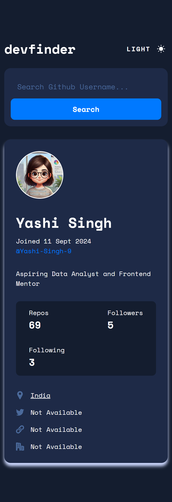

# Frontend Mentor - GitHub User Search App Solution

This is a solution to the [GitHub user search app challenge on Frontend Mentor](https://www.frontendmentor.io/challenges/github-user-search-app-Q09YOgaH6). Frontend Mentor challenges help you improve your coding skills by building realistic projects.

---

## Table of contents

* [Overview](#overview)

  * [The challenge](#the-challenge)
  * [Screenshot](#screenshot)
  * [Links](#links)
* [My process](#my-process)

  * [Built with](#built-with)
  * [What I learned](#what-i-learned)
  * [Continued development](#continued-development)
  * [Useful resources](#useful-resources)
* [Author](#author)
* [Acknowledgments](#acknowledgments)
* [Installation & Setup](#installation--setup)

---

## Overview

### The challenge

Users should be able to:

* Search for GitHub users by their username
* See relevant user information based on their search
* See a default user profile on page load
* Toggle between light and dark themes
* View optimal layout depending on device screen size
* See hover states for all interactive elements

---

### Screenshot

**Desktop Design**


**Mobile Design** 



---

### Links

* **Live Site URL**: [Live Site](https://yashi-singh-9.github.io/GitHub-User-Search-App/)

---

## My process

### Built with

* Semantic HTML5 markup
* Stylus (CSS Preprocessor)
* CSS custom properties for theming
* Flexbox and Grid Layout
* JavaScript (Vanilla)
* GitHub Users API
* Mobile-first responsive design

---

### What I learned

This challenge helped me understand how to:

* Fetch and handle data from a public API (GitHub)
* Use conditional rendering based on API responses
* Switch themes using JavaScript and CSS variables
* Use mobile-first techniques to create responsive layouts
* Dynamically handle empty or null values for user data

Example of loading a GitHub user on search:

```js
async function fetchGitHubUser(username) {
  const res = await fetch(`https://api.github.com/users/${username}`);
  if (!res.ok) {
    throw new Error("User not found");
  }
  return await res.json();
}
```

---

### Continued development

In the future, I’d like to:

* Add local storage to persist the selected theme
* Implement error messages with better UX
* Add loading indicators while fetching data
* Improve accessibility with ARIA roles and keyboard navigation

---

### Useful resources

* [GitHub API Documentation](https://docs.github.com/en/rest/users/users) – Essential for understanding available user fields.
* [Stylus Language Docs](https://stylus-lang.com/docs/) – Helped with writing clean and scoped styles.
* [Frontend Mentor Community](https://www.frontendmentor.io) – A great place to learn from others and get feedback.

---

## Author

* Frontend Mentor – [@Yashi-Singh-9](https://www.frontendmentor.io/profile/Yashi-Singh-9)
* LinkedIn – [Yashi Singh](https://www.linkedin.com/in/yashi-singh-b4143a246)

---

## Acknowledgments

Thanks to the Frontend Mentor team and community for creating helpful and realistic UI challenges. These projects really help developers grow by learning through building.

---

## Installation & Setup

### Prerequisites

* Ensure you have **Stylus** installed as your CSS preprocessor

### Install Stylus

Install globally:

```bash
npm install -g stylus
```

Or install locally in your project:

```bash
npm install stylus --save-dev
```

### Run the Project

1. Clone the repository:

```bash
git clone https://github.com/Yashi-Singh-9/Github-User-Search-App.git
```

2. Navigate to the project folder:

```bash
cd Github-User-Search-App
```

3. Compile Stylus to CSS:

```bash
stylus style.styl -o style.css
```

4. Open `index.html` in your browser to use the app.
